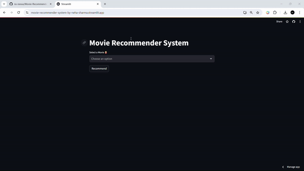
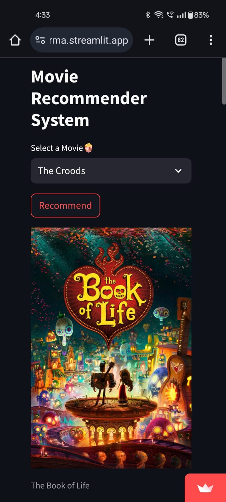

 
 

    
   
  A Machine Learning Project

 

## Project Overview

Welcome to the Movie Recommendation System project! This system employs a content-based approach, allowing users to select a movie and receive recommendations for similar movies based on various features.

Our Movie Recommendation System consists of several key components:

1. Data Preprocessing
2. Text Vectorization
3. Model Creation
4. Frontend Creation
5. Deployment
   
Let's dive into each of these components:

### Data Preprocessing
Dataset merging, cleaning, and feature selection were performed to ensure the quality of our data. The datasets were sourced from Kaggle consisted of data on 4803 movies - https://www.kaggle.com/datasets/tmdb/tmdb-movie-metadata/discussion

### Text Vectorization
Text vectorization techniques such as Bag of Words, Stemming, and Stop Words Removal were employed to process the textual data effectively.

### Model Creation
A similarity matrix was generated using Cosine Similarity to determine the likeness between movies, enabling accurate recommendations. Movie lists and similarity matrices were pickled for efficient storage and retrieval.

### Frontend Creation
Utilizing the Streamlit library, we crafted a user-friendly frontend for the recommendation model. The frontend includes a title, a selection box for users to choose a movie, and a "Recommend" button to trigger the recommendation process. Additionally, the posters of recommended movies will also show, as we generated an API key from the TMDB official website for the corresponding posters of the movies in the dataset.

### Deployment
The model is deployed online using the Streamlit Community Cloud, providing easy access to users. A deployment link is provided for seamless usage.

 

## Results

#### Desktop View

 

#### Phone View

 

## Deployment Link
#### https://movie-recommender-system-by-neha-sharma.streamlit.app/

 

## How to Use

1. Visit the deployment link provided.
2. Select a movie from the dropdown menu.
3. Click on the "Recommend" button.
4. Enjoy personalized recommendations based on your preferences!

 

<code>Neha Sharma</code>
